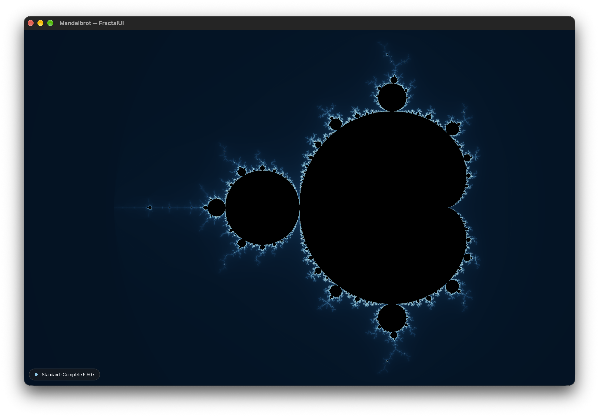
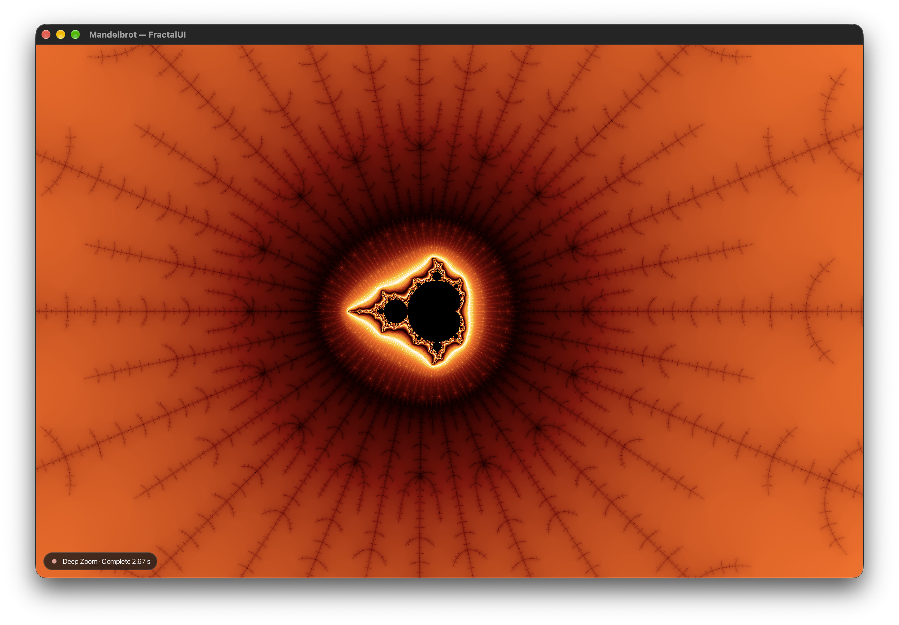
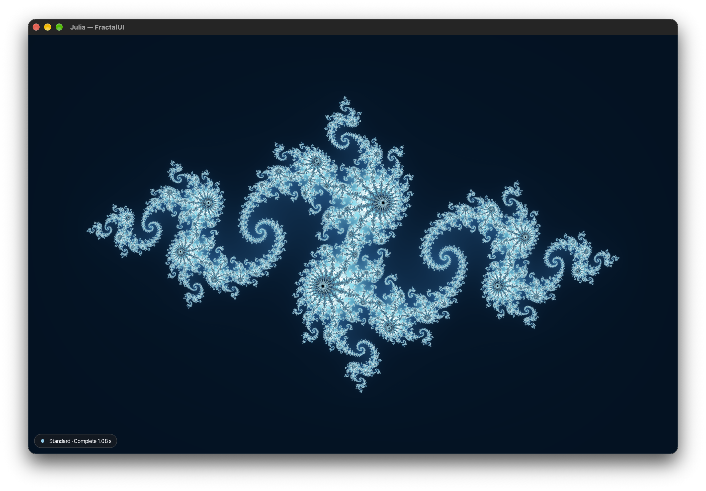

# FractalUI

FractalUI is a desktop fractal explorer for macOS and Windows, built with
Java 25 and JavaFX. It supports interactive exploration of Mandelbrot, Julia,
Burning Ship, Tricorn, and Multibrot sets, with deep zoom for Mandelbrot and
Julia, customizable coloring, saved sessions, and PNG export.

Rendering is CPU-based by default. Experimental Vulkan paths are available for
selected macOS workloads.



| Mandelbrot deep zoom | Julia |
| --- | --- |
|  |  |

## Highlights

- Java 25 and JavaFX desktop application for macOS and Windows.
- Precision-preserving Mandelbrot and Julia deep zoom.
- Parallel, cancellable CPU rendering with frame reuse and caching.
- Custom gradients, histogram coloring, orbit traps, and antialiasing.
- Versioned session persistence with backup recovery.
- Cross-platform CI covering macOS, Windows, and Ubuntu.
- Self-contained DMG and EXE packaging with `jlink` and `jpackage`.

## Features

- Explore Mandelbrot, Julia, cubic Multibrot, Burning Ship, and Tricorn presets.
- Explore deep Mandelbrot and Julia views.
- Change palette presets, edit gradient stops, animate smooth coloring, and use
  histogram coloring or orbit traps. Choose render quality and antialiasing
  settings.
- Export the current view as a PNG and continue from your saved scene the next
  time you open the application.

## Quick start

Requirements:

- JDK 25
- macOS or Windows with a graphical desktop session
- Xcode Command Line Tools on macOS

Run from the repository root:

macOS:

```sh
./mvnw compile javafx:run
```

Windows PowerShell:

```powershell
.\mvnw.cmd compile javafx:run
```

Windows Command Prompt:

```bat
mvnw.cmd compile javafx:run
```

The Maven Wrapper is included, so you do not need a separate Maven
installation. Maven resolves JavaFX and LWJGL dependencies on the first build.
On macOS, the build compiles the AppKit menu bridge and the development launch
creates a small launcher bundle; see [macOS launch](MACOS_RUN.md) for details.

The application opens at the default Mandelbrot view unless a valid saved
session exists.

## Controls

Drag to pan, scroll to zoom around the pointer, or enter decimal coordinates
for a specific view. When the canvas has focus, the arrow keys pan the view
after you zoom in; Page Up and Page Down zoom, and Home resets it. See
[macOS UI](MACOS_UI.md) for the full macOS menu and control reference.
The main controls work on both supported platforms; macOS also provides an
AppKit canvas context menu with a JavaFX fallback.

## Architecture

The Java module is `com.shangin.fractal`. Its main source areas are:

| Area | Responsibility |
| --- | --- |
| `formula`, `math`, `scene` | Fractal definitions, high-precision coordinates, and scene settings |
| `render` | CPU sampling, deep zoom, frame reuse, caches, and progress publication |
| `controller` | Render lifecycle, cancellation, and result coordination |
| `coloring`, `export` | Palettes, coloring modes, antialiasing, and PNG output |
| `ui`, `app` | JavaFX interaction, menus, application startup, and session restore |
| `gpu` | Optional Vulkan runtime and guarded GPU backends |
| `src/main/macos` | Native AppKit bridge and macOS launcher sources |

## Rendering

CPU rendering is the default on macOS and Windows. Mandelbrot and Julia deep
zoom use precision-preserving CPU rendering; viewport centers and scales retain
decimal precision instead of being reconstructed from rounded doubles. CPU
renders are asynchronous and cancellable. Frame reuse and caches avoid repeated
work during supported navigation and resize operations. The viewport shows
render progress as results arrive.

Experimental Vulkan paths are opt-in for selected macOS workloads. The limited
GPU calculation path is Mandelbrot-specific and does not provide GPU deep zoom.
Windows GPU support is not yet available; validation on Intel Macs and Macs
with AMD GPUs is still pending. See [GPU runtime](GPU_RUNTIME.md) and the
[roadmap](ROADMAP.md) for exact gates and current scope.

## Building and testing

Run the portable CPU-default test suite with:

```sh
./mvnw clean test
```

JavaFX integration and hardware-specific tests are opt-in and require an
appropriate desktop session or device. [CI](CI.md) describes the portable
macOS, Windows, and Ubuntu lanes and the separate hardware validation workflow.

## Packaging

The project can build self-contained macOS DMG and Windows EXE artifacts using
JDK `jlink` and `jpackage`. These packages include a runtime; the development
launcher above still uses the installed JDK. Packaging prerequisites,
provenance, clean-machine checks, and signing and notarization status are in
[Runtime packaging](RUNTIME_PACKAGING.md). Linux compatibility remains an
engineering target, but Linux is not currently a supported distribution.

## Documentation

- [Development roadmap](ROADMAP.md) — priorities, completed work, and open
  acceptance criteria.
- [macOS UI](MACOS_UI.md) and [macOS launch](MACOS_RUN.md) — controls and native
  integration.
- [Session format](SESSION_FORMAT.md) — saved-scene schema and recovery.
- [GPU runtime](GPU_RUNTIME.md) — Vulkan capability checks, CPU fallback, and
  current GPU scope.
- [CI](CI.md) and [Runtime packaging](RUNTIME_PACKAGING.md) — validation lanes
  and installable artifacts.
